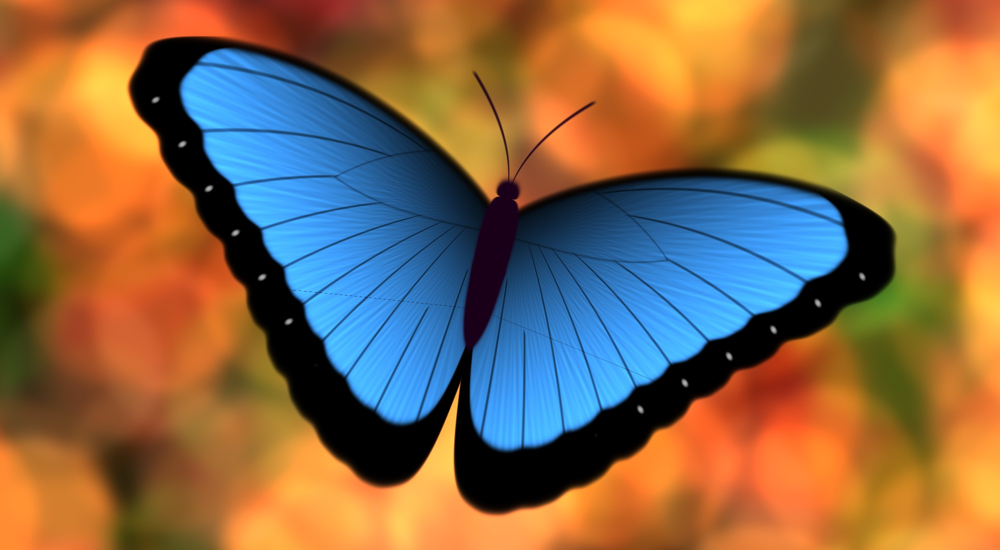

# c-morpho-butterfly

Hamid Naderi Yeganeh is an artist which draws pictures with mathematical equations: [Wikipedia](https://en.wikipedia.org/wiki/Hamid_Naderi_Yeganeh), [X](https://x.com/naderi_yeganeh), [Instagram](https://www.instagram.com/hamidnaderiyeganeh/), [YouTube](https://www.youtube.com/@naderiyeganeh).

Morpho buttterfly is one of its artworks ([X](https://www.instagram.com/p/DQmRlpliAVM/), [Instagram](https://x.com/naderi_yeganeh/status/1754107434224804305/)):

The present repository reproduces the work:

The program uses OpenMP to parallelize calculations and [STB library](https://github.com/nothings/stb) to create the output image.

(end of README)
